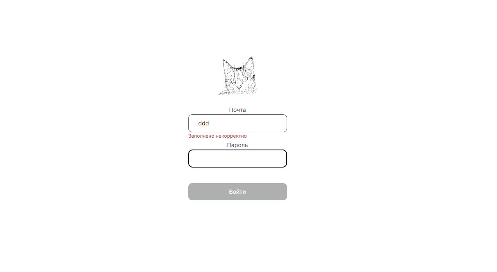
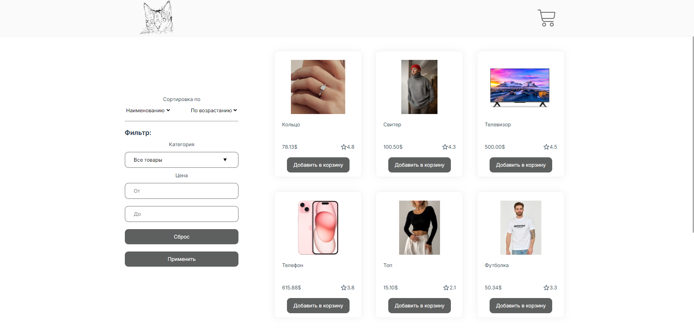
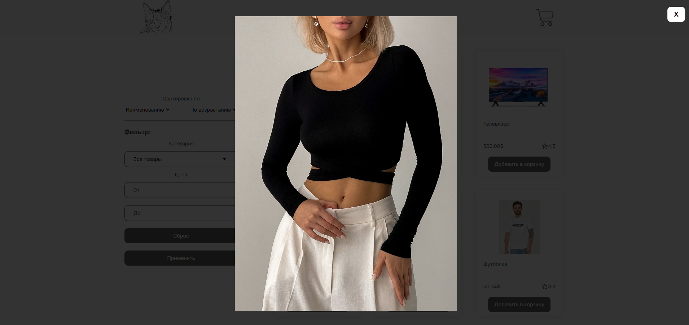
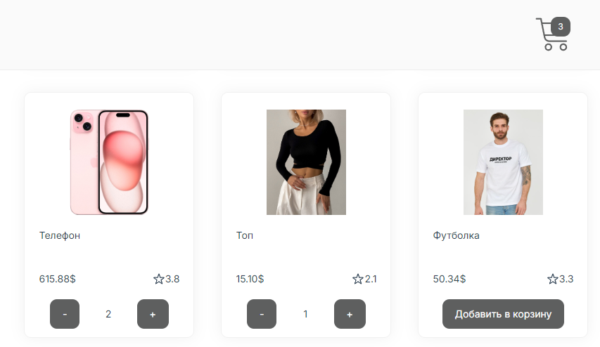
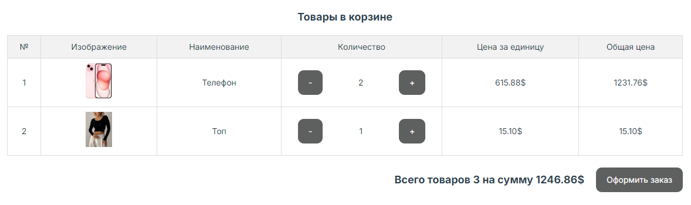
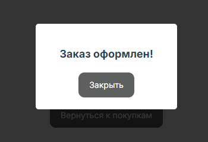

# Приложение electronic_showcase

## Описание

Интерфейс представляет собой интернет-магазин.

Реализована фейковая авторизация по почте и паролю с валидацией обоих полей.



На главной странице три раздела:
1. Шапка с логотипом - переход на главную страницу и переходом на страницу корзины.
2. Сортировка и фильтрация. Сортировка работает мгновенно, а для применения фильтров необходимо нажать кнопку "Применить", которая запускает проверку корректности заполнения фильтров.
3. Каталог с карточками товаров.



При клике на изображение в карточке товара открывается модальное окно с ним.



При клике на кнопку "Добавить в корзину", кнопки преобразуются в счетчик с действиями "добавить" и "убрать", а так же меняется индикатор корзины в шапке.



На странице корзины приводится сводная таблица заказа, в столбце "количество" можно менять счетчик и итоговое значение будет пересчитываться.



При клике на кнопку "Оформить заказ" открывается модальное окно с уведомлением, корзина очищается, происходит редирект на главную страницу.



## Технологии в проекте

HTML, CSS, Vue JS, Vuex, VueRouter

## Project setup
```
npm install
```

### Compiles and hot-reloads for development
```
npm run serve
```

### Compiles and minifies for production
```
npm run build
```

### Customize configuration
See [Configuration Reference](https://cli.vuejs.org/config/).
